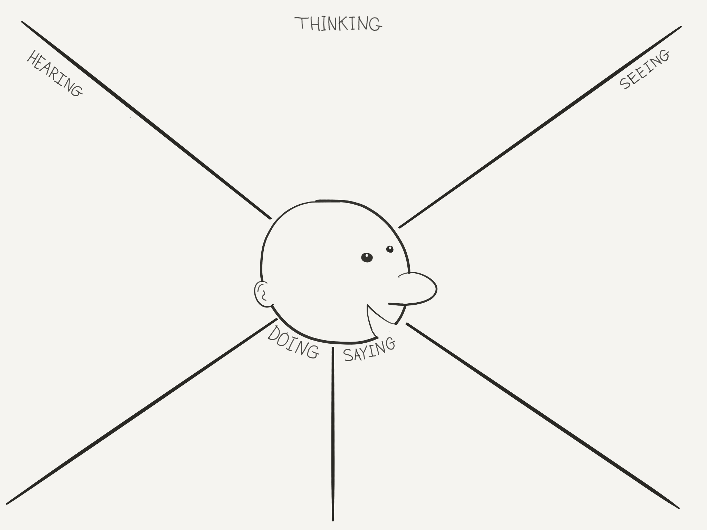

# Crafting Brilliant User Experiences with WordPress

> Tom Auger
> CTO, [Art & Science](http://artscience.ca)
> tom@artscience.ca
> 
> @TomAuger

---

## This presentation is on GitHub

https://github.com/TomAuger/WPBrilliantUX

---

## What's "experience design"?

Intentional problem-solving about the **end-to-end** experience

* Information Architecture
* Visual Experience
* Content
* Interaction Design
* Devices, Wearables
* Social sphere, extending the experience

---

## What's UX?

> The experience your User Groups has interacting with a digital affordance or property

---

## Who ARE these "User Groups"?

It depends who you ask.

---

### Your clients, of course!

* purchasers
* decision-makers
* influencers
* researchers, short-listers
* checkbox-tickers

---

### Anyone else?

* job seekers
* media
* staff
* sales
* admins
* competition?

---

### Machines?

* search engines / schema
* AT / a11y

---

## User-Centric Experience Design Methodology

1. List as many user groups as you can
2. List your project success criteria / project objectives
3. Revisit your user groups, maybe add more
4. Rank them (unique numbers only!)
5. Determine your cutoff for Target User Groups
6. Understand your Target User Groups
7. Determine your segmentation strategy
8. Design Brilliant Experiences for those User Groups

---

### Multiple UX?

Yes!

But how do you deliver multiple experiences from the same site?

---

### WordPress "Users" vs. non-users

* `is_user_logged_in()` and `current_user_can()`
* `is_admin()`

---

### Mobile vs. Tablet vs. Desktop use cases

* Responsive Design?
* `is_mobile()`?!
* [Mobble](https://github.com/scottsweb/mobble/blob/master/Mobile_Detect.php)?
* [mobiledetect.net](http://mobiledetect.net/)!
* JS & WP_API

---

### Locale

* JavaScript geolocation API [navigator.geolocation](https://developer.mozilla.org/en-US/docs/Web/API/Geolocation/Using_geolocation)
* GeoIP [Location Services](https://www.maxmind.com/en/geoip2-precision-services)
* Enterprise Detection
* i18n

---

### User Self-Identification

* IA, baby!
* Profile self-selection
* Wizard, guided help?
* Pain points, calls to action

---

## Understand your user groups

---

### Empathy Mapping

**Empathy** vs. **Sympathy**: Sympathy is having feelings in response to someone, empathy is having the *same* feelings.
		
> Empathy mapping helps you answer the question: "Our users need a better way to _X_  **because** _Y_ "

---

### Empathy Map

[Download Empathy Map on GitHub](https://github.com/TomAuger/WPBrilliantUX/blob/master/img/EmpathyMapPosterByTomAuger.png)

---

### Creating an Empathy Map

* **SEEING**
	* What is their **environment**?
	* **Who** else is in their environment?
	* What **competitive** products do they see?
* **HEARING**
	* What are **others saying** about the topic?
	* Who are they **influenced by**?
	* What are the **messages** put out by the competition?

---

### Creating an Empathy Map (cont'd)

* **THINKING (and feeling)**
	* What are their **fears** (pains)?
	* What are their **dreams and goals** (gains)?
	* What are their **expectations** about the topic?
	* What are they **emotional** about?
* **SAYING**
	* What do they do or say **in public**?
	* What do they say **to you**?
* **DOING**
	* How do they **influence** others?
	* What **actions** do they take?

---

*Example questions:*
* How do they think about their *fears and hopes*?
* What do they hear when *other people use your product*?
* What do they see when they *use your product*? What is the environment?
* What do they say or feel when using your product, whether in private or public?
* What are their *pain points* when using your product?
* Is this a *positive or a painful* experience for them?
* What does a *typical day* look like in their world?
* Do they hear *positive feedback* about your product from external sources?
* What do they hope to *gain* from using your product?
* Has your customer repeated *quotes* or defining words?

---

### Personas & User Scenarios

> A persona represents a cluster of users who exhibit similar behavioral patterns in their purchasing decisions, use of technology or products, customer service preferences, lifestyle choices, and the like. Behaviors, attitudes, and motivations are common to a "type" regardless of age, gender, education, and other typical demographics. In fact, personas vastly span demographics.
	
> -- Kevin O'Connor, [UX Mag](http://uxmag.com/articles/personas-the-foundation-of-a-great-user-experience)

*(see Jem's upcoming talk)*

---

## Crafting Brilliant Experiences

---

### What's a Brilliant User Experience?

> A discrete interaction with a digital property that appears to be designed expressly for the user currently having that experience.

---

### The Five Dimensions of Web User Interaction
		
* **1D: words** should communicate effectively at appropriate reading level
* **2D: visuals** aesthetic, effective visual language; colours; imagery; iconography
* **3D: interface** intuitive, minimal, natural, recognizable
* **4D: time** sequencing, pacing, animation, repeat visits
* **5D: emotion** comes from empathy, relationship beyond the site

---

### What are the characteristics of a Usable interface?
		
* **Learnability**: how easily can a new user learn to navigate the interface?
* **Understandability**: how well can a user understand what they are seeing?
* **Memorability**: if a user hasn’t visited the system in a while, how well will they remember the interface?
* **Flexibility**: how many ways can a user interact with the system?
* **Robustness**: how well are we supporting users when they face errors, how many errors do they make, and how quickly can they recover from them?
* **Attractiveness**: how visually appealing is the interface?
* **Accessibility**: how accessible is the interface to all users, regardless of ability, technology, or cultural bias?

---

### Brilliant Experiences for your Clients

* Consider intent-based targeting (See, Think, Do, Care) [Avinash Kaushik](http://www.kaushik.net/avinash/see-think-do-content-marketing-measurement-business-framework/)
* Understand needs and behaviours
* Provide the right path to goals
* Measure, analyze, adjust

---

### Brilliant Experiences for Staff

* Craft the Administrative UX
* Consider the Admin IA
* Builders/themes (eg: [X-theme](http://theme.co/x/), [Cornerstone](https://theme.co/cornerstone/), [ACF](https://www.advancedcustomfields.com/))
* Don't shy away from deep WP customization

---

### Accessible Experiences for Everyone

* Accessibility is about **access** not **ability**
* We all benefit from Accessibility
* Better UX == Better A11y

---

### Brilliant Experiences for Machines

Search engines like Google, Screen Readers and assistive technologies, feeds and alternative means of consuming content all need to "understand" your site's structure and content.

* Semantic markup
* Use microdata from [schema.org](http://schema.org/docs/gs.html)

---

## Care about the UX

Brilliant experiences require:

* Intentionality
* Empathy
* Technical Ability
* Humility
* Agility

---

## Questions?

---

## Thank you

> Join @TomAuger @BrentKobayashi @Pasada and guests on Agency Chat Every Wednesday at 2:00 PM EST

https://blab.im/agencychatshow
